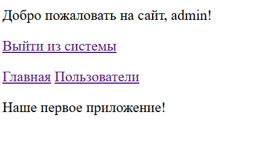
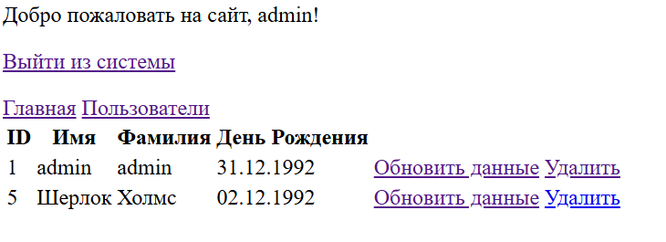
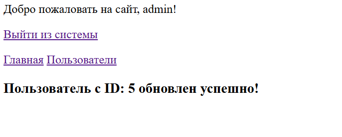
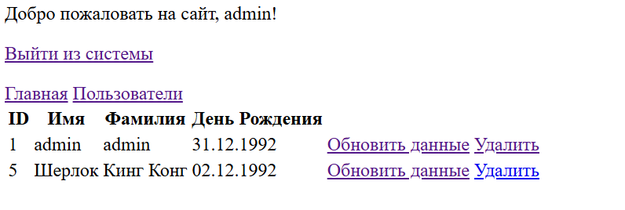
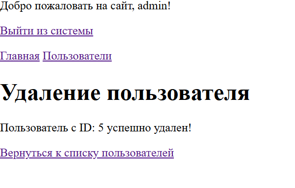

# Домашняя работа
1. `При помощи регулярных выражений усильте проверку данных в validateRequestData так, чтобы пользователь не смог передать на обработку любую строку, содержащую HTML-теги (например, <script>)`
```
  public static function validateRequestData(): bool {
        $result = true;
        
        if (!( 
            isset($_POST['name']) && !empty($_POST['name']) &&
            isset($_POST['lastname']) && !empty($_POST['lastname']) &&
            isset($_POST['birthday']) && !empty($_POST['birthday'])
        )) {
            $result = false;
        }

        $_POST['name'] = htmlspecialchars($_POST['name'], ENT_QUOTES, 'UTF-8');
        $_POST['lastname'] = htmlspecialchars($_POST['lastname'], ENT_QUOTES, 'UTF-8');
        
        if (!preg_match('/^(\d{2}-\d{2}-\d{4})$/', $_POST['birthday'])) {
            $result = false;
        }
    
        if (!isset($_SESSION['csrf_token']) || $_SESSION['csrf_token'] != $_POST['csrf_token']) {
            $result = false;
        }
    
        return $result;
    }
 ```

2. Доработайте шаблон аутентификации. В нем нужно добавить две вещи:

В приветствии нужно выводить имя залогинившегося пользователя.
Также надо выводить ссылку «Выйти из системы», которая будет уничтожать сессию пользователя.



3. Переработайте имеющийся функционал приложения на формы.

Создание, обновление и удаление пользователя теперь должно производиться через формы.
Если пользователь обновляется, в форму должны быть выведены текущие значения. Это может быть сделано ссылкой из списка пользователей (рядом с каждым из них будет своя ссылка “Обновить данные”).







5. Исправьте потолстевший Абстрактный контроллер.

```
class AbstractController {

    protected array $actionsPermissions = [];
    
    public function getUserRoles(): array {
        if (!isset($_SESSION['id_user'])) {
            return ['user'];  
        }

        return User::getUserRolesById($_SESSION['id_user']);
    }

    public function getActionsPermissions(string $methodName): array {
        return $this->actionsPermissions[$methodName] ?? [];
    }
}
```
вынес метод в User
```
 public static function getUserRolesById(int $userId): array {
        $roles = ['user'];  

        $rolesSql = "SELECT role FROM user_roles WHERE id_user = :id";
        $handler = Application::$storage->get()->prepare($rolesSql);
        $handler->execute(['id' => $userId]);
        $result = $handler->fetchAll();

        if (!empty($result)) {
            foreach ($result as $role) {
                $roles[] = $role['role'];
            }
        }

        return $roles;
    }
    
```
